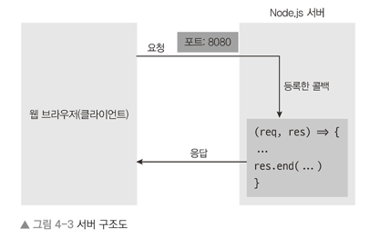
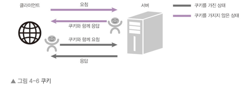

## http 모듈
- 클라이언트의 요청을 읽고 응답할 수 있도록 해주는 모듈  

## Cookie
- 인터넷 사용자가 어떠한 웹사이트를 방문할 경우 사용자의 웹 브라우저를 통해 인터넷 사용자의 컴퓨터나 다른 기기에 설치되는 작은 기록 정보 파일 또는 데이터
- 쿠키는 서버에서 발급하여 요청과 응답의 헤더에 저장되어 같이 전송됨  

## Session
- 웹 사이트의 여러 페이지에 걸쳐 사용되는 사용자 정보를 저장하는 방법
  - 세션은 서비스가 돌아가는 서버 측에 데이터를 저장하고 클라이언트에는 해당 데이터를 조회할 수 있는 키값만을 넘겨줌
  - 클라이언트에게 키값만을 노출시킴으로서 보안에 취약한 쿠키를 보완
