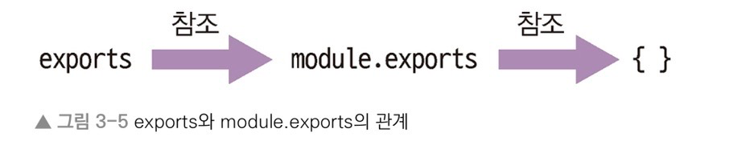
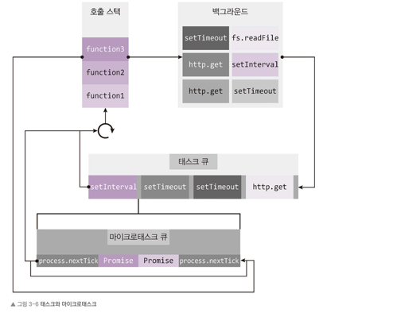

## Node 의 내장 객체
- Node 에서 기본적으로 제공해주는 내장 객체
- 별도의 설치 없이 바로 사용 가능

## 내장 객체의 종료
### global
- 브라우저의 window 와 같은 전역 객체
- 생략하여 사용 가능
  - ex) global.console.log => console.log

### console
- 디버깅, 로깅을 위해 주로 사용하는 객체
- console.time(레이블)
  - console.timeEnd(레이블) 과 대응되어 같은 레이블을 가진 time 과 timeEnd 사이의 시간을 측정
- console.log(내용)
  - 평범한 로그를 콘솔에 표시
- console.error(에러 내용)
  - 에러를 콘솔에 표시
- console.dir(객체, 옵션)
  - 객체를 콘솔에 표시할 때 사용
  - 옵션에 따라 콘솔에 색을 넣거 표시하거나 객체 안의 객체를 몇 단계까지 보여줄지를 결정할 수 있음
- console.trace(레이블)
  - 에러가 어디서 발생했는지 추적할 수 있음

### 타이머
- 타이머 기능을 제공하는 함수
- setTimeout(콜백함수, 밀리초)
  - 주어진 밀리초 이후에 콜백함수를 실행
  - clearTimeout(아이디) 로 setTimeout 을 취소
- setInterval(콜백함수, 밀리초)
  - 주어진 밀리초마다 콜백함수를 실행
  - clearInterval(아이디) 로 setInterval 을 취소
- setImmediate(콜백함수, 밀리초)
  - 콜백함수를 즉시 실행
  - clearImmediate(아이디) 로 setImmediate 을 취소

### __filename / __dirname
- __filename
  - 현재 파일명을 확인
- __dirname
  - 현재 파일이 위치한 폴더의 경로를 확인

### module, exports
- 모듈을 만들 때 사용하는 객체  
  
*exports 객체에 다른 값을 넣으면 exports 와 module.exports 와의 참조관계가 끊어지므로 주의해야한다.*

### process
- 현재 실행되고 있는 노드 프로세스에 대한 정보를 담고 있는 객체
- process.env
  - 시스템의 환경 변수들을 담고 있는 객체
  - 일반적으로 .env 파일에 환경 변수들을 설정하고 해당 값들을 사용함
- process.nextTick(콜백함수)
  - 이벤트 루프가 다른 콜백함수들보다 nextTick 의 콜백함수를 우선으로 처리하도록 함  
      
    *resolve 된 Promise 와 nextTick 의 콜백함수는 다른 콜백들보다 우선으로 처리되며 이를 마이크로 태스크로 따로 구분짓기도 한다.*
- process.exit(코드)
  - 실행중인 노드 프로세스를 종료
  - 코드 번호가 0 이거나 없으면 정상 종료를 의미
  - 코드 번호가 1이면 비정상 종료를 의미