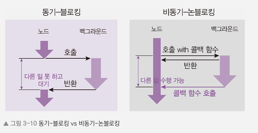

## 동기 - 블로킹 / 비동기 - 논블로킹

### 동기 - 블로킹
- 백그라운드 작업 완료 여부를 확인하여 해당 작업이 끝나야 함수를 return 처리함
- 동기 함수를 호출한 부분 이후의 코드가 실행되지 않고 대기

### 비동기 - 논블로킹
- 호출한 함수가 백그라운드 작업 완료 여부와 상관없이 return 되며 나중에 백그라운드가 알림을 줄 때 해당 값을 통해 처리함
- 비동기 함수를 호출한 부분 이후의 코드가 비동기 함수의 return 을 기다리지 않고 실행될 수 있음

### 동기 - 블로킹 / 비동기 - 논블로킹 비교
- 동기와 비동기 : 함수가 바로 return 되는지의 여부
- 블로킹과 논블로킹 : 백그라운드 작업 완려 여부
