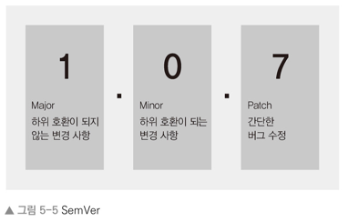

## npm
- Node Package Manager
- 자바스크립트 프로그래밍 언어를 위한 패키지 관리자
  - 자바 진영의 Maven Repository 와 같은 역할
- npm 에 등록되어 있는 패키지를 찾아 설치할 수 있다.

### package.json
- 설치된 패키지 및 버전을 관리하기 위한 파일
  - gradle 파일과 같은 역할을 담당

### package.json 생성
```markdown
npm init
```
```json
{
  "name": "package",
  "version": "1.0.0",
  "description": "- Node Package Manager - 자바스크립트 프로그래밍 언어를 위한 패키지 관리자   - 자바 진영의 Maven Repository 와 같은 역할 - npm 에 등록되어 있는 패키지를 찾아 설치할 수 있다.",
  "main": "index.js",
  
  // scripts - npm 명령어를 저장해두는 부분 npm run [명령어] 를 입력하여 해당 스크립트를 실행
  "scripts": {
    "test": "echo \"Error: no test specified\" && exit 1"
  },
  "repository": {
    "type": "git",
    "url": "git+https://github.com/Ruby-Learn/Node-learn.git"
  },
  "author": "",
  "license": "MIT",
  "bugs": {
    "url": "https://github.com/Ruby-Learn/Node-learn/issues"
  },
  "homepage": "https://github.com/Ruby-Learn/Node-learn#readme",

  // dependencies - npm 을 통해 설치한 패키지를 기록. npm install 을 통해 기록된 패키지를 다시 설치할 수 있다. 패키지는 node_modules 폴더에 설치
  //  - package.json 파일이 있다면 필요한 패키지들을 npm install 을 통해 다시 설치할 수 있으므로 node_modules 는 git 등에 보관할 필요가 없다.
  "dependencies": {
    "express": "^4.18.2"
  }
}
```

### package-lock.json
- npm 으로 패키지를 설치, 수정, 삭제할 때마다 내부 의존관계를 저장
  - package.json 에 기재된 패키지와 의존관계에 있는 모든 패키지가 기재됨

### package version
- 노드 패키지들의 버전은 항상 세 자리로 구성되며 각 자리마다 의미를 가짐
  - ex) 1.0.7
- 첫 번째 자리
  - major 버전을 가리킴
    - 0 - 초기 개발 중
    - 1 - 정식 버전
  - 하위 호환이 안 될 정도로 패키지의 내용이 수정되었을 때 major 버전을 올림
- 두 번째 자리
  - minor 버전을 가리킴
  - 하위 호환이 되는 기능 업데이트 시에 minor 버전을 올림
  - 기존 하위 버전에서 minor 버전을 업데이트 했을 때에는 아무 문제가 없어야 함
- 세 번째 자리
  - patch 버전을 가리킴
  - 새로운 기능의 추가가 아닌 기존 기능에 문제가 있던 부분을 수정한 경우에 patch 버전을 올림  
    

### 기타 npm 명령어
- npm outdated
  - 업데이트할 수 있는 패키지가 있는지 확인
- npm update
  - 업데이트 가능한 모든 패키지를 업데이트
- npm uninstall [패키지명] / npm rm [패키지명]
  - 지정한 패키지를 제거
- npm search [검색어]
  - npm 저장소로부터 패키지를 검색