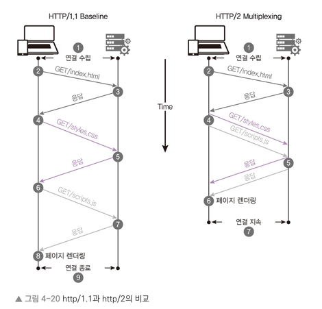

## HTTPS
- HyperText Transfer Protocol over Secure Socket Layer
- HTTP 의 보안이 강화된 버전
    - SSL 이나 TLS 프로토콜을 통해 세션 데이터를 암호화함으로서 데이터의 적절한 보호를 보장
- 기본 TCP/IP 포트번호로 443 를 사용
- HTTPS 를 적용하기 위해서는 인증 기관에서 발급받은 인증서가 필요

## HTTP/2
- HTTP/1.1 에서 개선된 버전
- 기존 HTTP/1.1 보다 개선되어 효율적으로 요청을 보냄  
