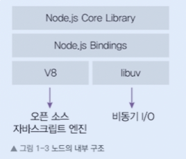
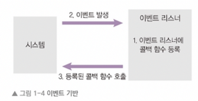
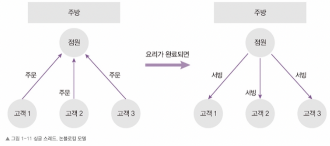
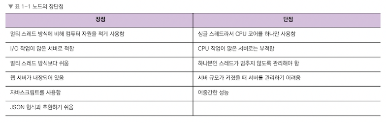

## Node.js
- 크롬 V8 자바스크립트 엔진으로 빌드된 자바스크립트 런타임
    - 런타임
        - 특정 언어로 만든 프로그램들을 실행할 수 있는 환경
- Node 의 내부 구조 
  

## Node 의 특징
- 이벤트 기반의 작업 수행
  - 이벤트가 발생할 때 미리 지정해둔 작업을 수행
      - ex ) 클릭, 네트워크 요청이 있을 때 작업을 수행
  - 이벤트가 발생하면 이벤트 리스너에 등록해둔 콜백함수를 호출하여 발생한 이벤트가 없거나 이벤트를 다 처리하면 다음 이벤트가 발생할 때까지 대기 
    
- 논블로킹 I/O
  - 오래 걸리는 함수를 백그라운드로 보내서 다음 코드가 먼저 실행되게 하고, 그 함수가 다시 태스크 큐를 거쳐 호출 스택으로 올라오기를 기다리는 방식
      - 이전 작업이 완료될 때까지 대기하지 않고 다음 작업을 수행하게 함 
        
  - Node 는 논블로킹 I/O 모델을 사용함으로서 가볍고 효율이 좋음
- 싱글 스레드
  - 노드는 기본적으로 싱글 스레드, 논블로킹 방식으로 작업을 수행함
  - 내부적으로는 스레드를 여러 개 가지고 있지만 직접 제어할 수 있는 스레드는 하나 뿐임 
    

## 서버로서의 Node

## Node.js 설치

- 노드 다운로드 - [https://nodejs.org](https://nodejs.org)
    - LTS
        - 기업을 위해 3년간 지원하는 버전
        - 서버를 안정적으로 운영해야 할 경우 사용하는 버전
    - Current
        - 최신 기능을 담고 있는 버전
        - 서버에 신기능이 필요할 때 사용. 다소 실험적인 기능이 들어 있어 예기치 못한 에러가 발생할 수 있음
- 노드 설치시에 npm 이 같이 설치됨
- 노드 버전 확인
    - node -v
- npm 버전 확인
    - npm -v
    - npm 의 버전이 낮다면 npm 을 별도로 받아 업데이트
        - npm i -g npm