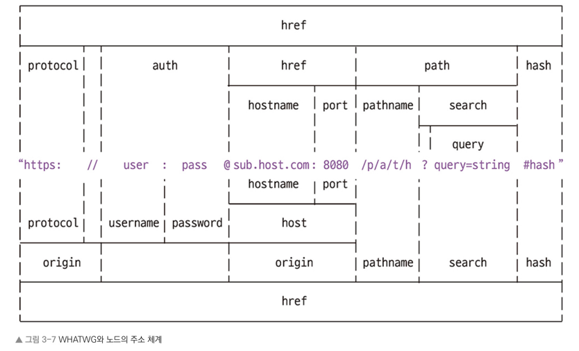

## Node 의 내장 모듈
- Node 에서 기본적으로 제공해주는 모듈

## 내장 모듈의 종류
### os
- 운영체제의 정보를 확인할 수 있게 해주는 모듈

### path
- 폴더와 파일의 경로를 쉽세 조작하도록 도와주는 모듈

### url
- 인터넷 주소를 쉽게 조작하도록 도와주는 모듈  
    
    *가운데 주소를 기준으로 위쪽은 기존 노드의 url 구분 방법. 아래쪽은 WHATWG 의 url 구분 방법*  

### querystring
- 기존 노드의 url 을 사용할 때 search 부분을 사용하기 쉽게 객체로 만드는 모듈

### crypto
- 다양한 방식의 암호화를 도와주는 모듈
- 단방향, 양방향 암호화를 지원함

### util
- 각종 편의 기능을 모아둔 모듈

### fs
- 파일 시스템에 접근하는 모듈
- 파일을 생성하거나 삭제, 읽거나 쓸 수 있게 해줌