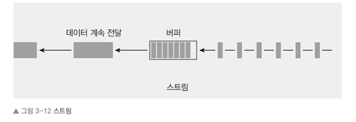

## 버퍼
- 바이너리 데이터를 읽거나 조작할 수 있게 해주는 객체  

- Buffer.from(문자열)
  - 문자열을 버퍼로 변환.
- Buffer.toString(버퍼)
  - 버퍼를 다시 문자열로 변환
- Buffer.concat(버퍼 배열)
  - 배열 안에 든 버퍼들을 합쳐 하나의 버퍼로 변환
- Buffer.alloc(바이트)
  - 빈 버퍼를 생성. 바이트를 인자로 지정해주면 해당 크기의 버퍼를 생성

## 스트림
- 파일 또는 대량의 데이터를 관리 가능한 작은 청크, 버퍼로 분해하여 전송하게 해주는 방법  
  
- fs.createReadStream(읽을 파일 경로, 옵션)
  - 지정한 파일의 데이터를 읽을 수 있게 해주는 스트림
- fs.createWriteStream(생성할 파일 경로, 옵션)
  - 데이터를 출력하여 파일을 생성할 수 있게 해주는 스트림
- pipe
  - 스트림끼리 연결시켜주는 함수